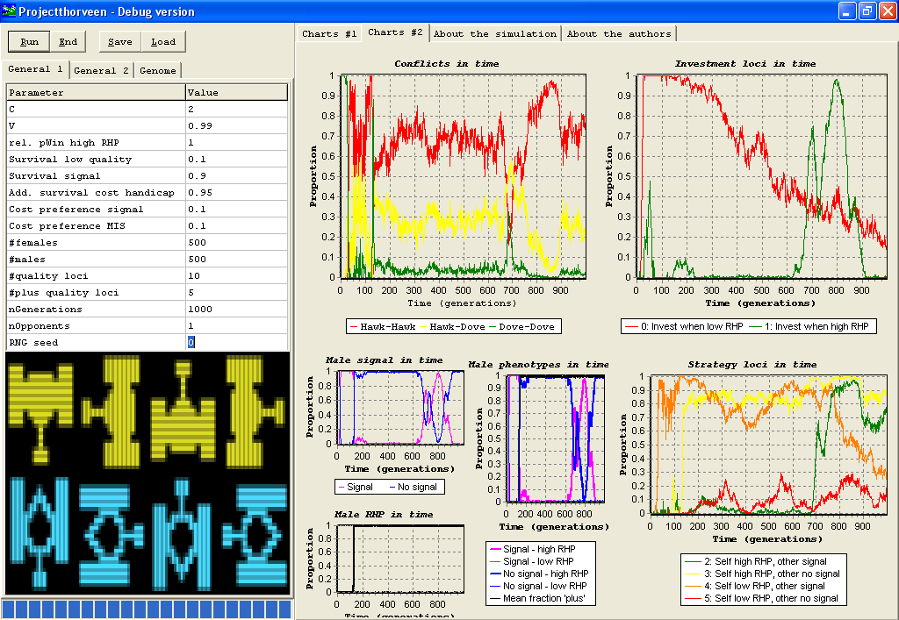
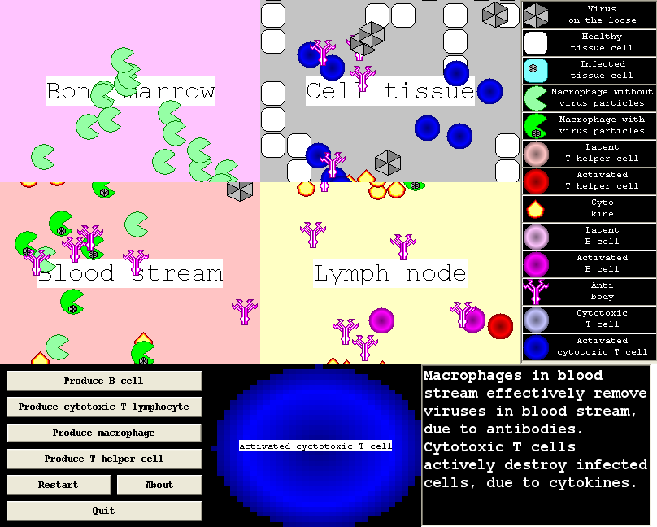

GIHKAL
========================================================
author: Richel J.C. Bilderbeek
date: 2019-11-08
autosize: true

[https://github.com/richelbilderbeek/gihkal](https://github.com/richelbilderbeek/gihkal)


Inspiration
========================================================


***

> We can 'sell' our work to empicists by using GUIs
>
> Liang Xu, 2019-11-08

```

[Python logo here]

```

The early days, 2002
========================================================


> Richel,
>
> I want you to set up a C++ programming course
> that teaches how to program a GUI

***


Why use GUIs?
========================================================

Or: why have I made dozens op programs with a GUI?

***


Why use GUIs?
========================================================

 * ...
 * ...
 * ...
 * ...
 * ...

***

```

C++ logo here

```

```

R logo here

```

Why use GUIs?
========================================================

 * Explore
 * ...
 * ...
 * ...
 * ...

***

Characteristics:

 * Complex
 * Many parameters
 * Plots

========================================================


========================================================


========================================================



========================================================

```


Show van_doorn_and_weissing_2001


```

[https://github.com/richelbilderbeek/van_doorn_and_weissing_2001](https://github.com/richelbilderbeek/van_doorn_and_weissing_2001)

========================================================

```


Show daisieme


```

[https://github.com/richelbilderbeek/daisieme](https://github.com/richelbilderbeek/daisieme)

========================================================

```


Show MutualismBreakdowner


```

[https://github.com/richelbilderbeek/MutualismBreakdowner](https://github.com/richelbilderbeek/MutualismBreakdowner)

Why use GUIs?
========================================================

 * ~~Explore~~
 * Verify
 * ...
 * ...
 * ...

***

Characteristics:

 * Complex
 * Specific
 * Plots

========================================================


========================================================


========================================================


========================================================


***


Why use GUIs?
========================================================

 * ~~Explore~~
 * ~~Verify~~
 * Introduce
 * ...
 * ...

***

Characteristics:

 * Complex
 * Parameters
 * Output -> input

========================================================


========================================================

```

Show lumier

```

[https://github.com/ropensci/lumier](https://github.com/ropensci/lumier)

Why use GUIs?
========================================================

 * ~~Explore~~
 * ~~Verify~~
 * ~~Introduce~~
 * Laymen
 * ...

***

Characteristics:

 * Simple
 * Few parameters
 * Plots

========================================================


========================================================


========================================================



Why use GUIs?
========================================================

 * ~~Explore~~
 * ~~Verify~~
 * ~~Introduce~~
 * ~~Laymen~~
 * Fun

***

Characteristics:

 * Fun
 * Cool graphics

========================================================


========================================================


========================================================

> Thanks for making programming fun again

***

```
[picture of anyonymous person]
```


Why don't we use GUIs?
========================================================

 * Not taught
 * ...

***

```
[picture of Franjo frowning]
```

Why don't we use GUIs?
========================================================

 * ~~Not taught~~
 * Misconceptions:
   * 'Too much work'
   * ...

***

Type   |SLOC|%
-------|----|---
GUI    | 614|11
Logic  |4921|89

`daisieme` stats

Why don't we use GUIs?
========================================================

 * ~~Not taught~~
 * Misconceptions:
   * ~~'Too much work'~~
   * 'Slower'
   * ...

***


Why don't we use GUIs?
========================================================

 * ~~Not taught~~
 * Misconceptions:
   * ~~'Too much work'~~
   * ~~'Slower'~~
   * 'Cannot run on cluster'
   * ...

***


Why don't we use GUIs?
========================================================

 * ~~Not taught~~
 * Misconceptions:
   * ~~'Too much work'~~
   * ~~'Slower'~~
   * ~~'Cannot run on cluster'~~
   * 'Run takes too long'

***


Conclusion
========================================================

## GUIs can be used as a way to learn or to teach.

## ...

Conclusion
========================================================

## ~~GUIs can be used as a way to learn or to teach.~~

## With GUIs, we can express ourselves in more ways

My idea
========================================================

## We should teach GUIs

## It improves learning

## Franjo is IMHO right

***


Franjo Weissing, sprite from [https://github.com/](https://github.com/)
[richelbilderbeek/franjo_pong](richelbilderbeek/franjo_pong)

Questions
========================================================

# ?
